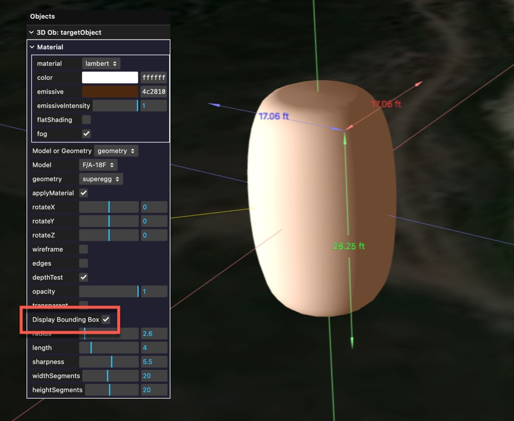

To simulate a potential UAP, Sitrec can display a variety of 3D models. There's some built-in, like planes and aerostats. You can also create simple geometric shapes like spheres and boxes. For full flexibility, you can import a custom 3D model. 

To experiment with this functionality, start with the model inspector, found at Sitrec->Tools->Model Inspector. 

Once in the Model Inspector, you will get the default object, and two views on that object. You can double-click on a view to make it full screen. 

Most of the object-specific adjustments are done with the "Objects" menu. For convenience, you can drag this off the menu bar to keep it open. Here I've also opened the "Time" menu, which is used for setting the sun direction.

With "Model or Geometry" set to "Geometry" you can experiment with a variety of different shapes.

You can also adjust the material (the surface appearance of the object). There are various different types.
- Basic: No lighting, the object will simply appear all the same color
- Lambert: Simple illumination where the object is affected by the sunlight. There's an additional color "missive", which is how much light the object itself emits (i.e. if it's self-illuminating, like a lantern)
- Phong: Similar to Lambert  
- Physical: A more physically realistic material, with more parameters. 

When experimenting with these settings, use the "Lighting" and "Time" menus to experiment with different lighting situations. For example, here's a very rough approximation of a lantern with an orange glow illuminated by low sun.

### Built-in Models

There are also some built-in models. To use them, change the mode from "geometry" to "model" and select a model from the drop-down.

You can also apply the custom material to the object. This is a good way of quickly getting neutral color scheme. Here I'm using a physical material that's similar to the actual material, above. 

### Dimensions

The geometry specification are in meters. You can see the dimensions of the bounding box of an object by checking "Display Bounding Box" in the Object menu. This will display the dimensions in your default units (feet or meters).  

## Supported Model Formats

Sitrec supports two model file formats:

- **GLB** (.glb) — Binary glTF format. Includes geometry, materials, and textures in a single file. This is the primary format for authored models (aircraft, drones, etc.). Created via Blender or other 3D tools.
- **PLY** (.ply) — Polygon File Format. Sitrec handles three types of PLY content:
  - **Mesh PLY** (contains faces): Rendered as a standard lit mesh. Vertex colors are used if present.
  - **Gaussian Splat PLY** (contains `splatScale` and `splatRotation` attributes): Rendered using instanced elliptical Gaussian splatting with back-to-front sorting. This is the format produced by 3D Gaussian Splatting tools.
  - **Point Cloud PLY** (vertices only, no faces or splat attributes): Rendered as a point cloud with size attenuation.

Both formats can be dragged and dropped into the Model Inspector or any moddable sitch.

### Filename Length Parameter

You can embed the real-world length of a model directly in its filename using the format `#L<value><units>#`. When Sitrec loads the model, it reads this parameter and automatically sets the model scale so the longest dimension matches the specified length.

**Format:** `modelname#L<number><units>#.glb` (or `.ply`)

**Supported units:**
- Meters: `m`, `meter`, `meters` — e.g. `shahed#L3.5m#.glb` (3.5 meters)
- Feet: `f`, `ft`, `feet` — e.g. `drone#L24.5ft#.glb` (24.5 feet)
- No unit defaults to feet — e.g. `thing#L100#.glb` (100 feet)

This is particularly useful for models that don't have a consistent internal scale, or when you want to quickly try different sizes without editing the model. The length parameter is applied when the model loads — you can still adjust the "Model Length" slider in the Objects menu afterward.

## Custom Models using Blender

The geometries are only intended for simple tests. For more flexibility you can create or import a custom model.

Models are typically authored in GLB format. You don't need to use Blender to make them, but that's the only documented pipeline. Other tools should be similar.

Internally, Sitrec uses the metric system. So you need to set this in Blender if you want your models to be consistently sized.

### Blender Orientation and scale

When creating a model, such as an aircraft, the forward direction should be along the negative y-axis. This makes it consistent with the OpenGL coordinate system used by Sitrec. In Blender, you can see the directions of the axes with the axes widget. RGB, Red, Green, and Blue are X, Y, and Z. 

The aircraft should be centered so its center of gravity is at the origin. This generally means the Y-axis will pass through the nose.

The aircraft should be level, as if it is wheels down. Angle of attack adjustments are done at run-time. This usually means the wings and horizontal stabilizers are level.

The size of the object can be seen in the bounding box dimensions. Ensure this matches expectations. The bounding box only works for single objects, so if your object is multi-part then you'll have to use another method. 

### Blender materials 

Blender commonly uses the "Principled BSDF" material, an industry standard "physical" material which is largely supported in WebGL, and hence in Sitrec. For more details, see:
<https://docs.blender.org/manual/en/2.80/addons/io_scene_gltf2.html>

If you import a model from a format like FBX, Collada, or Wavefront/OBJ, you might need to adjust the material in Blender before exporting. If a material is opaque and you expected it to be transparent, then you might simply need to set the Blend Mode to "Alpha Blend"

### Blender Exporting

You will edit the model in Blender and save to a .blend file. For Sitrec, export as .glb, which is the binary version of glTF, including both geometry and materials in a single file.
To export a file, use File->Export-> glTF 2.0 (.glb/.gltf).

Click on "Remember Export Settings" and then ensure the following are set:

Then export the file. If you want to embed a known real-world length, rename the file to include a length parameter (e.g. `my-drone#L3.5m#.glb`). You should now be able to drag and drop this into the Sitrec model inspector, or any moddable sitch that supports it (e.g. FLIR1).

### PLY Files

PLY files don't go through the Blender export pipeline. They are typically produced by:
- **3D scanning** software (mesh or point cloud output)
- **Gaussian Splatting** training tools (e.g. from COLMAP → 3DGS training)
- **Point cloud** capture tools (LiDAR, photogrammetry)

Sitrec auto-detects which type of PLY it is by inspecting the file header. If the PLY has face elements, it's loaded as a mesh. If it has `scale_0`/`rot_0` attributes, it's treated as a Gaussian splat. Otherwise it's rendered as a point cloud.

Gaussian splat PLY files are rendered with proper elliptical splatting and per-frame back-to-front sorting for correct transparency. The filename length parameter (`#L...#`) works with PLY files too.

