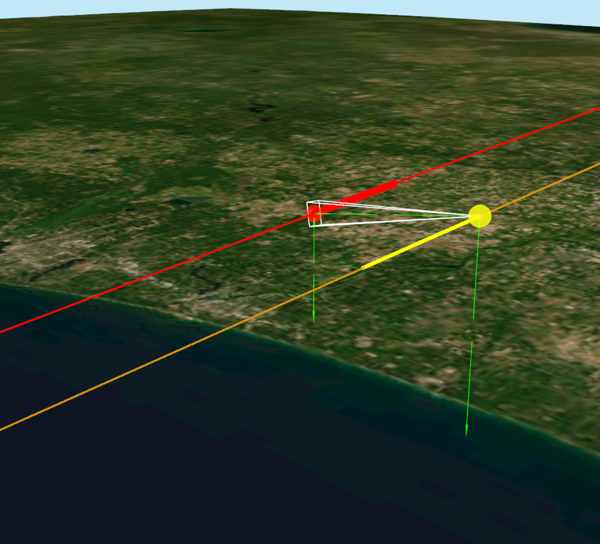
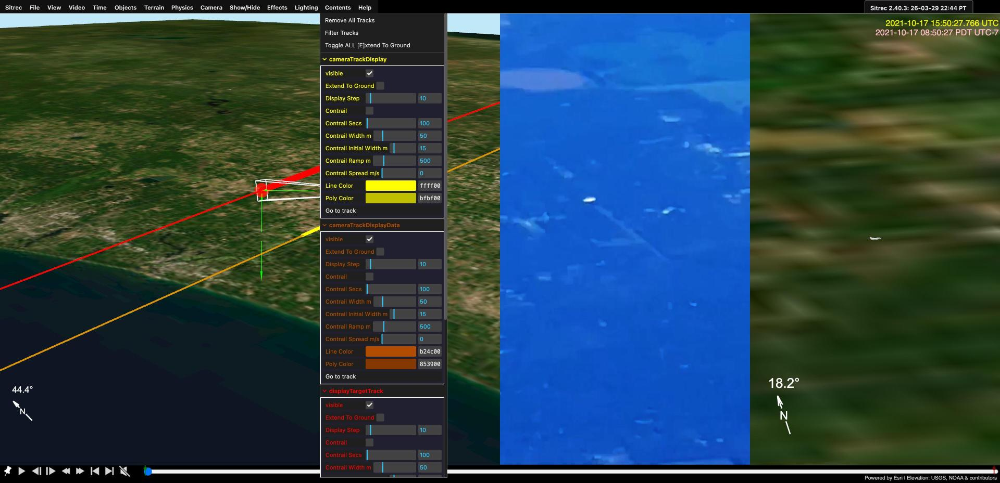

# Loading and Filtering Tracks

Tracks are the core data type in Sitrec. A track is a time-series of 3D positions (latitude, longitude, altitude) that represents the path of an aircraft, drone, satellite, balloon, or other object. Most sitches are built around one or more tracks.

This guide covers:
- [Supported track formats](#supported-track-formats)
- [Importing tracks](#importing-tracks)
- [Working with multiple tracks](#working-with-multiple-tracks)
- [Track display controls](#track-display-controls)
- [Filtering bad data](#filtering-bad-data)
- [Smoothing and interpolation](#smoothing-and-interpolation)
- [Altitude handling](#altitude-handling)
- [Timing and synchronization](#timing-and-synchronization)
- [Exporting tracks](#exporting-tracks)

## Supported Track Formats

Sitrec auto-detects the format of imported files. You don't need to specify the type — just drag and drop.

### ADS-B / Flight Tracking (KML/KMZ)

The most common track source. Export a KML or KMZ file from a flight tracking service:

- **FlightRadar24** (flightradar24.com)
- **Planefinder.net**
- **FlightAware** (flightaware.com)
- **ADSB Exchange** (adsbexchange.com)

KML files can contain **multiple tracks** (e.g., all flights in an area during a time window). When you import a multi-track KML, Sitrec shows a selection dialog so you can choose which tracks to load.

### DJI Drone Data (CSV)

DJI drone flight logs exported from [Airdata](https://airdata.com) in CSV format. These include full IMU data: position, altitude, heading, pitch, roll, and gimbal orientation.

### DJI Drone Subtitles (SRT)

SRT metadata files extracted from DJI drone video. These contain per-frame position and gimbal angles embedded as video subtitles.

### MISB / KLV (CSV or binary)

Military-standard metadata (STANAG 0601) from surveillance platforms. Contains sensor position, gimbal angles, field of view, frame center coordinates, and slant range. Can be in CSV form (with MISB column headers) or binary KLV format.

### STANAG 4676

NATO track exchange format. A single file can contain up to three sub-tracks: platform position (posHigh), dynamics/center, and ground position (posLow).

### Generic CSV

Flexible format with auto-detected columns. Sitrec recognizes common column names (case-insensitive):

| Column Names | Data |
|-------------|------|
| `DATETIME`, `UTC`, `TIME`, `DATE`, `DTG` | Timestamp (ISO, epoch, or relative) |
| `LAT` / `LATITUDE`, `LON` / `LONGITUDE` | Position in degrees |
| `MGRS` | Military Grid Reference System coordinates |
| `ALTITUDE`, `ALT`, `ALTITUDE(FT)`, `ALTITUDEKM` | Altitude (various units) |
| `AIRCRAFT`, `CALLSIGN` | Identification |
| `TRACK_ID` | For multiple tracks in one CSV |
| `AZIMUTH` | Camera azimuth angle |

**Multiple tracks in one CSV**: If a `TRACK_ID` column is present, Sitrec splits the data into separate tracks by ID.

**Time formats**: Sitrec auto-detects ISO dates, Unix epoch (seconds, milliseconds, or microseconds), and relative/frame-based timestamps.

**Grid coordinates**: Both MGRS and Maidenhead (ham radio) grid locators are supported.

### FlightRadar24 CSV

Direct CSV export from FlightRadar24 with fixed columns: Timestamp, UTC, Callsign, Position, Altitude, Speed, Direction.

### GeoJSON

Standard GeoJSON FeatureCollections with Point geometries. Supports multiple tracks via `thresherId` or `dtg` properties.

### Radiosonde / Weather Balloon

Atmospheric sounding data from weather balloons:

- **IGRA2** format (NOAA fixed-width text)
- **UWYO** format (University of Wyoming, TEXT:LIST or TEXT:CSV)

These reconstruct 3D trajectories from atmospheric profiles and include wind, pressure, and temperature data. Sonde tracks can be colored by temperature gradient and display wind direction arrows.

### FlightClub JSON

Rocket and high-altitude balloon trajectory data from FlightClub, with orbital propagation support.

### NITF

National Imagery Transmission Format files with embedded metadata.

## Importing Tracks

There are two ways to get a track into Sitrec:

### Drag and Drop

Drag a track file from your desktop directly into the Sitrec browser window. This is the quickest method.

When a track is loaded, Sitrec automatically centers the 3D view over the track and sets up a camera that follows it.

### File Menu Import

Use **File > Import** to open a file picker. This works identically to drag and drop.

### What Happens When a Track Loads

1. Sitrec detects the file format automatically
2. The track data is parsed and converted to an internal representation
3. The 3D view centers over the track
4. A colored track line appears in the scene
5. Track controls appear in the **Contents** menu on the right

## Working with Multiple Tracks

### Two-Track Setup (Camera + Target)

The most common setup for analyzing UAP videos uses two tracks:

- **First track imported** = camera platform (the aircraft filming)
- **Second track imported** = target object (the UAP or other aircraft)

Sitrec automatically calculates the closest point of approach and sets the region of interest accordingly.

### Selecting from Multi-Track Files

When you import a file containing **three or more tracks** (common with ADS-B KML exports covering an area), Sitrec shows a **Track Selection Dialog**:

- Each track is listed with its callsign/name and altitude range
- Checkboxes let you select which tracks to import
- A **Filter** panel provides additional filtering options (see below)

### Multi-Track Filter Panel

The filter panel (available during multi-track import and later from the Contents menu) lets you narrow down which tracks to load:

| Filter | Description |
|--------|-------------|
| **Altitude Range (ft)** | Only show tracks with points within the specified altitude range |
| **Crosses Frustum** | Only show tracks that pass through the camera's field of view |
| **Towards Camera** | Only show tracks moving towards the camera position |
| **Away from Camera** | Only show tracks moving away from the camera position |

These filters use preview data and work within the current sitch time window.

### Managing Loaded Tracks

Each loaded track gets its own folder in the **Contents** menu. You can:

- **Show/hide** individual tracks with the visibility checkbox
- **Recolor** tracks using the Line Color picker (the folder label color updates to match)
- **Remove** a track with the Remove button (with confirmation)
- **Highlight** a track by hovering over its folder label (the track line turns white temporarily)
- **Center camera** on a track using the "Go to Track" button

## Track Display Controls

Each track's folder in the Contents menu provides these controls:

### Visibility and Appearance

| Control | Description |
|---------|-------------|
| **Visible** | Show or hide this track |
| **Line Color** | Color picker for the track line |
| **Poly Color** | Color for the ground extension polygons |
| **Extend To Ground** | Draw semi-transparent vertical walls from the track down to the terrain |
| **Display Step** | Frame spacing (1-100). Higher values skip frames for sparser display |

### Contrails

Contrails simulate the visual appearance of condensation trails behind aircraft, adjusted for wind:

| Control | Range | Description |
|---------|-------|-------------|
| **Contrail** | on/off | Enable contrail ribbon rendering |
| **Contrail Secs** | 2-5000 | Duration of the contrail in seconds |
| **Contrail Width m** | 10-200 | Maximum ribbon width in meters |
| **Contrail Initial Width m** | 0-100 | Width at the exhaust point |
| **Contrail Ramp m** | 0-2000 | Distance over which width ramps up |
| **Contrail Spread m/s** | 0-20 | Rate of outward spread |

### Altitude Adjustments

| Control | Range | Description |
|---------|-------|-------------|
| **Alt offset** | -1000 to +1000 m | Manual altitude adjustment |
| **Alt Lock** | -1 to 100,000 ft | Force a fixed altitude (-1 = off) |
| **Alt Lock AGL** | on/off | When locked, use altitude above ground level instead of MSL |

## Filtering Bad Data

ADS-B and other track data sources sometimes contain **spurious data points** — sudden position jumps caused by reception errors, multipath interference, or encoding issues. Sitrec includes a g-force filter that detects and removes these bad points.

### How the G-Force Filter Works

The filter computes the acceleration (in g) between consecutive valid points. Any point that would require physically impossible acceleration to reach is flagged as bad data. For example, a sudden 50-nautical-mile jump between adjacent data points implies thousands of g's of acceleration — clearly an error.

### Filter Controls

Each data track has a **Filter Bad Data** folder with:

| Control | Default | Description |
|---------|---------|-------------|
| **Enable Filter** | off | Turn the g-force filter on or off |
| **Try Altitude First** | on | Before removing a point entirely, try fixing just its altitude by interpolating from neighbors. Many ADS-B errors are altitude-only |
| **Max G** | 10.0 | Acceleration threshold in g (0.1-10). Points exceeding this are filtered. 10g allows for sparse curved tracks where computed g can be high; most spurious data generates 100g+ |

### What Gets Filtered

- The filter runs **multiple passes**, iteratively removing the worst points
- Filtered points are hidden from the display but the original data is preserved
- If "Try Altitude First" is enabled, the filter attempts to **correct** altitude before removing the point entirely
- A typical bad ADS-B point generates 100g+ of apparent acceleration, well above the 3g default threshold

## Smoothing and Interpolation

Track data is often noisy or sparse. Sitrec provides several smoothing methods to clean up track paths:

### Available Methods

| Method | Description |
|--------|-------------|
| **None** | No smoothing — raw data points |
| **Moving Average** | Rolling average with polynomial edge handling |
| **Sliding Average** | Sliding window average |
| **Savitzky-Golay** | Polynomial-fitting filter that preserves peaks better than simple averaging |
| **Spline (Catmull-Rom)** | Smooth curve through interpolated control points |
| **Spline (Data-Driven)** | Chordal Catmull-Rom spline through the actual data points |

### Smoothing Parameters

| Parameter | Description |
|-----------|-------------|
| **Window** | Rolling window size (larger = smoother) |
| **Iterations** | Number of smoothing passes |
| **Poly Order** | Polynomial degree for Savitzky-Golay |
| **Tension** | Catmull-Rom spline tension (0 = loose, 1 = tight) |
| **Intervals** | Number of control points for spline fitting |

## Altitude Handling

Track altitudes come in several reference systems. Understanding these is important for accurate 3D reconstruction. See also [GIS, Geodesy, and Altitude](GIS.md) for a full reference.

### Altitude Types

| Type | Reference | Common Sources |
|------|-----------|---------------|
| **HAE** (Height Above Ellipsoid) | WGS84 ellipsoid | Raw GPS, ADS-B `alt_geom` |
| **MSL** (Mean Sea Level) | Geoid (EGM96) | KML `absolute`, MISB Tag 15, most map software |
| **Pressure Altitude** | Standard atmosphere (1013.25 hPa) | ADS-B `alt_baro`, flight instruments |
| **AGL** (Above Ground Level) | Local terrain | DJI `rel_alt`, some military data |

### How Sitrec Handles Altitude

- Internally, Sitrec works in **HAE** (ellipsoid height) for 3D rendering
- Terrain tiles are loaded as **MSL** and converted to HAE using the **EGM96** geoid model
- KML `absolute` altitudes are treated as approximately HAE for practical compatibility
- If a track has only AGL altitude, Sitrec adds the local terrain elevation
- The **Alt offset** slider lets you manually correct systematic altitude errors

### Common Altitude Issues

- **Track appears underground**: The altitude reference may not match Sitrec's expectation. Try a positive Alt offset.
- **Track is too high**: Some ADS-B sources report pressure altitude, which can differ from geometric altitude by hundreds of feet depending on weather. Try a negative Alt offset.
- **Inconsistent altitude between tracks**: Different sources use different references (HAE vs MSL vs pressure). The EGM96 geoid offset at a given location can be up to ~100 meters.

## Timing and Synchronization

### Absolute Timestamps

Most track formats include absolute timestamps (UTC). Sitrec uses these to:

- Determine the sitch time window automatically
- Synchronize multiple tracks on the same timeline
- Sync tracks with video (when video has embedded timecode)

### Relative Timestamps

Some formats (frame numbers, seconds from zero) don't have absolute times. For these tracks:

- A **Track Start Time** field appears in the track's GUI folder
- Enter an ISO datetime (e.g., `2024-03-15T14:30:00Z`) or partial time (e.g., `14:30`) to anchor the track
- Sitrec uses the [chrono-node](https://github.com/wanasit/chrono) library to parse flexible date/time input

### Time Offset

Every track has a **Time offset** slider (-600 to +600 seconds) for fine-tuning synchronization. This is useful when:

- Video and track timestamps are slightly out of sync
- Different data sources have clock drift
- You need to manually align events

## Exporting Tracks

Sitrec can export tracks in several formats via the export buttons in each track's folder:

### Export Formats

| Format | Contents |
|--------|----------|
| **CSV** | Frame, Time, Lat, Lon, Alt(m) — simple tabular data |
| **KML** | Google Earth compatible with `<gx:Track>`, timestamps, and altitude mode |
| **MISB CSV** | Full 12-column MISB-standard format including heading, pitch, roll, FOV, gimbal angles |

Exported files are downloaded directly to your browser's download folder.

## MISB Track Data

MISB (Motion Imagery Standards Board) tracks contain rich metadata beyond simple position. When a MISB track is loaded, Sitrec can use:

- **Sensor position** (lat, lon, alt) — where the camera is
- **Platform attitude** (heading, pitch, roll) — orientation of the aircraft
- **Gimbal angles** (azimuth, elevation, roll) — where the camera is pointing relative to the aircraft
- **Field of view** (horizontal, vertical) — zoom level of the camera
- **Frame center** (lat, lon, elevation) — where the camera footprint hits the ground
- **Slant range** — distance from camera to target

This data enables Sitrec to reconstruct the exact camera frustum (the pyramid-shaped field of view) and project it onto the terrain.

For a detailed walkthrough of importing MISB data, see the [Custom Sitch Tool](CustomSitchTool.md) guide.
