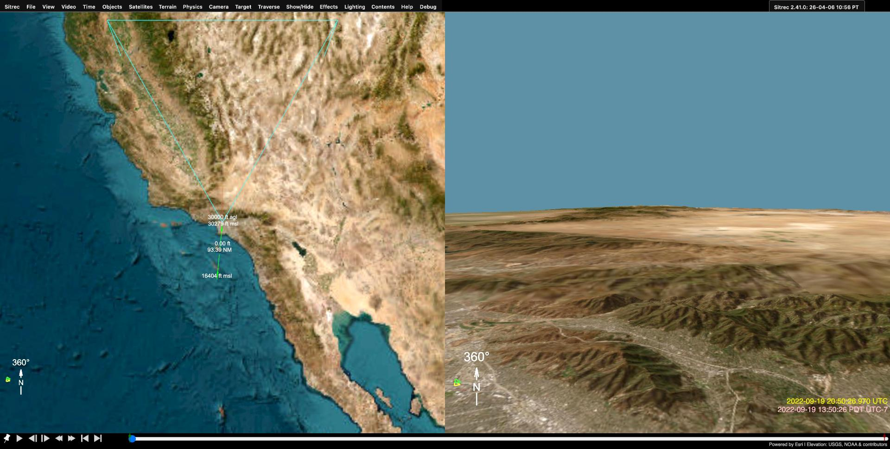
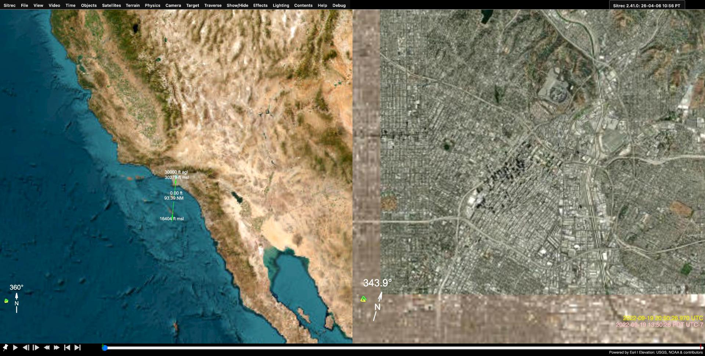

# Camera View Modes: Normal and Satellite

Sitrec's look camera supports two orientation modes for the PTZ (Pan-Tilt-Zoom) controller: **Normal** mode and **Satellite** mode. They serve different viewing scenarios and solve different geometric problems.

---

## Normal Mode (default)

Normal mode uses conventional **Azimuth/Elevation** angles to point the camera. It works the way most people expect: drag left/right to pan horizontally, drag up/down to tilt vertically.

- **Azimuth (Az)**: Horizontal heading in degrees (0 = north, 90 = east)
- **Elevation (El)**: Vertical tilt from the horizon (-89 to +89 degrees)
- **Roll**: Camera roll around the viewing axis
- **FOV**: Field of view in degrees

This is the natural choice when the camera is looking roughly toward the horizon, as in aircraft-based scenarios.

*Normal mode over Los Angeles at 30,000 ft. The left panel shows the overview; the right panel shows the look camera view toward the horizon.*

### When Normal Mode Breaks Down

Normal mode suffers from **gimbal lock** when the camera points straight down (nadir) or straight up (zenith). At elevation -90 or +90, azimuth and roll become indistinguishable — small mouse drags produce wild, unpredictable rotations. This is a fundamental limitation of Euler angle representation, not a bug.

This is a problem for analyzing satellite imagery, drone footage, or any scenario where the camera is looking straight down at the ground.

---

## Satellite Mode

Satellite mode uses a **quaternion-based** orientation system referenced to the local nadir (straight down). It is designed for overhead viewing where normal mode's gimbal lock makes the camera unusable.

- **Roll**: Acts as heading — rotates the view around the nadir axis (like rotating a map)
- **Elevation (El)**: Tilt from nadir (0 = straight down, -90 = nadir, values toward 0 tilt toward horizon)
- **Azimuth (Az)**: Horizontal offset from the tilt direction
- **FOV**: Field of view in degrees

In satellite mode the elevation slider range expands to -270 to +90 degrees, allowing full-sphere coverage without singularities.

*Satellite mode over Los Angeles. The look camera (right panel) points straight down at nadir with no gimbal lock. Mouse dragging pans smoothly in screen space.*

### How Mouse Interaction Differs

| | Normal Mode | Satellite Mode |
|---|---|---|
| **Horizontal drag** | Changes azimuth (world-space pan) | Rotates around camera Y axis (screen-space pan) |
| **Vertical drag** | Changes elevation (world-space tilt) | Rotates around camera X axis (screen-space tilt) |
| **Reference frame** | World north/up | Camera-local axes |

In normal mode, dragging left always pans toward west regardless of camera orientation. In satellite mode, dragging left always moves the view left on screen — the rotation is applied in camera-local space, which feels more intuitive when looking straight down.

---

## Switching Between Modes

### Manual Toggle

The **Satellite** checkbox appears in the PTZ controller panel (under Camera > Use Angles). Check it to enter satellite mode; uncheck to return to normal mode.

### Automatic Switching

Sitrec detects when you drag the camera into a near-vertical orientation (within ~0.001 degrees of nadir or zenith) and **automatically enables satellite mode** to prevent gimbal lock. The switch happens transparently — your viewing direction is preserved, only the internal representation changes.

When auto-switching occurs:
1. The current camera orientation is captured as a quaternion
2. Roll is extracted as the heading component
3. Azimuth resets to 0
4. Elevation is set to -90 (nadir) or +90 (zenith)
5. The Satellite checkbox activates

You can manually uncheck Satellite to return to normal mode if you tilt the camera back toward the horizon.

---

## Technical Details

### Nadir Reference Frame

Satellite mode constructs a local reference frame at the camera position:
- **X axis** = local east
- **Y axis** = local north
- **Z axis** = local up (away from Earth center)

The camera quaternion is then: `nadirFrame * satelliteQuat`, where `satelliteQuat` encodes the roll/elevation/azimuth offsets using intrinsic ZXY Euler order.

### When to Use Each Mode

| Scenario | Recommended Mode |
|---|---|
| Aircraft FLIR video analysis | Normal |
| Satellite imagery comparison | Satellite |
| Drone nadir footage | Satellite |
| Horizontal scene reconstruction | Normal |
| Near-vertical viewing angles | Satellite (auto-activates) |
| General-purpose 3D navigation | Normal |

### Serialization

The satellite mode state (on/off, quaternion, slider values) is saved and restored with custom sitches. Switching modes does not lose any orientation information — the camera direction is preserved across mode changes.
